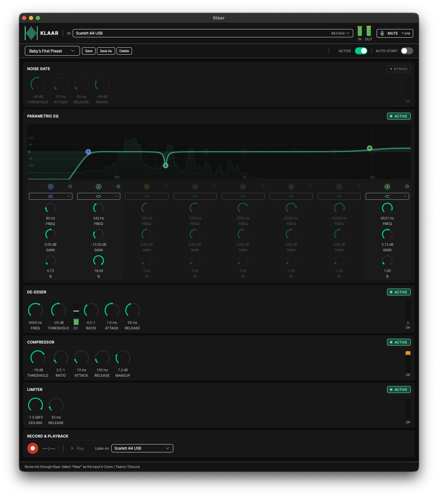

# Klaar

Klaar ("clear" in Estonian) is a real-time microphone processing app for macOS. It runs your mic through a
fixed chain — **noise gate → 8-band parametric EQ → de-esser → compressor
→ limiter** — and exposes the processed signal as a virtual microphone
that any communication app (Zoom, Teams, Discord, FaceTime, Slack, Google
Meet, …) can select as its input. It also adds a global mute keyboard schortcut, so you don't have to remember the various shortcuts different apps use.

It ships with its own CoreAudio HAL driver and runs from the menu bar.



## Why

I have a decent mic and audio interface, but wanted an easy way to process my microphone signal for online calls. I could purchase something like a [dbx 286s](https://dbxpro.com/en/products/286s) and that would work great. Or I could run that processing digitally. The latter is possible via e.g. running VSTs inside a DAW or OBS and using preexisting loopback solutions to route the audio to your conference app. But I wanted something simpler and lightweight.

If you are using the AirPods mic or something similar, Klaar's utility would probably be minimal. If you have a somewhat decent mic you can get close to, Klaar can help provide that final polish.

## Install

Download the latest DMG from the
[Releases page](https://github.com/JyrgenSuvalov/klaar/releases),
drag `Klaar.app` to `/Applications`, and launch it. Klaar walks you
through installing the driver behind a single admin prompt; a reboot is
required to finish loading the driver into `coreaudiod`.

First launch is blocked by Gatekeeper because Klaar is ad-hoc signed —
see [`docs/installation.md`](docs/installation.md) for the override
steps and uninstall instructions.

## Tips on "sounding good"

- [Syntax episode "How to Look and Sound Good at $10, $100 and $1000 With Producer Randy"](https://syntax.fm/show/857/how-to-look-and-sound-good-at-usd10-usd100-and-usd1000-with-producer-randy)
- ["Make Your Voice Sound Better - Vocal EQ Zones" by In The Mix on YouTube](https://youtu.be/pjMCyLsRNig?si=ocWk1LxfjifiPd9o)
- [Dan Worrall's YouTube video on his voice over chain](https://youtu.be/LKE1atmZnE0?si=2PM1rFLmBabIUmqp)

## Build

Requirements:

- macOS 13+ on Apple Silicon or Intel
- Rust (stable, via [rustup](https://rustup.rs/))
- [pnpm](https://pnpm.io/) and Node 20+
- Xcode Command Line Tools

```bash
pnpm install
pnpm build:release          # host arch
pnpm build:release:universal # fat x86_64+arm64
```

`build:release` chains the driver build, ad-hoc signing, the Tauri bundle,
and a verification pass (codesign, Mach-O slice type, architecture
coverage) — use it for any artifact that leaves your machine. The output
DMG lands in `src-tauri/target/release/bundle/dmg/`.

## Develop

```bash
pnpm install
pnpm dev:app
```

`dev:app` rebuilds the driver crate, ad-hoc signs and stages the bundle
(Tauri doesn't copy resources during `tauri dev`), then launches
`pnpm tauri dev`. Re-run it whenever the driver changes; for
frontend-only iteration, plain `pnpm tauri dev` is enough. Once the app
is running, use the `install_driver` IPC command to register the driver
with `coreaudiod`.

Full operational notes — driver pipeline, code signing, version-bump
policy, listener architecture, DMG packaging — live in
[`docs/developing.md`](docs/developing.md).

## Test

```bash
cargo test          # Rust DSP, engine, IPC commands
pnpm test           # Frontend (Vitest)
cargo clippy        # Rust lints
pnpm lint           # Frontend lints
pnpm typecheck      # TypeScript type-check
```

For long-running soak tests (memory stability, xruns, CPU profiling) see
[`docs/performance-testing.md`](docs/performance-testing.md).

## License

MIT
